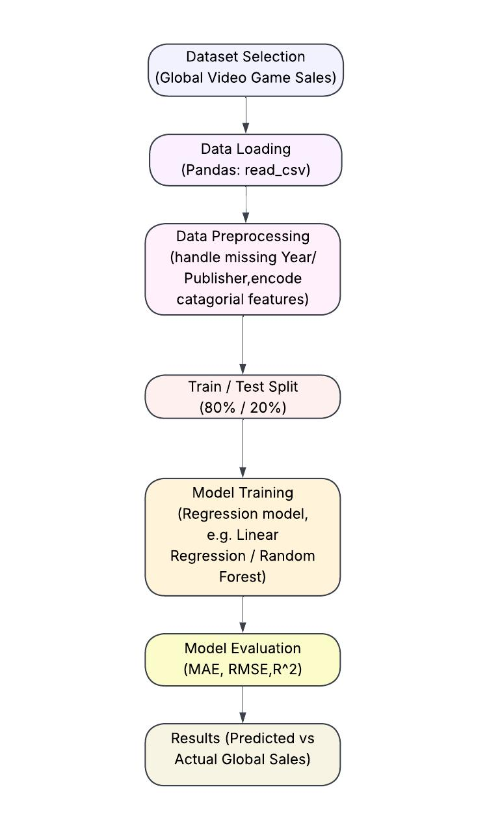

# Lab 3: Identifying ML Problems, Selecting Open Datasets, and Drawing a Methodology Diagram
### ARTI 308 – Machine Learning

### Group Members

| Names | ID |
| --- | --- |
| Arwa Alkhathlan | 2250030009 |
| Noor Albuainain | 2250030050 |
| Zainab Alharbi | 2250030246 |
| Joud Albeijan | 2250030261 |
| Sheehana Alghamdi | 2250030084 |
| Reem Alshehab | 2250030257 |

### Part 1: Choosing an Open Dataset

**Dataset:** Global Video Game Sales
##### link: https://www.kaggle.com/datasets/samanfatima7/cleaned-global-video-game-sales-dataset

### Part 2: Defining the Machine Learning Problem

* Is this a regression, classification, or clustering problem? 

Regression


* Is there a target variable?

Global_Sales — a continuous numeric value representing total worldwide sales in millions of units.

* What is the model expected to learn or predict?

The model is going to learn the relationship between a video game's descriptive attributes its platform, release year, genre, and publisher and how well it sells worldwide. Once trained, it should be able to prediact a new game expected Global_Sales in millions of units.

* Write a short problem description in your own words.

this project is to create a regression model based on the dataset Global Video Game Sales to predict the total number of sales of a video game globally. Every row in the dataset is a video game with it's details as shown in the table below

| Column | Description |
| --- | --- |
| **Rank** | Integer ranking of the game based on sales |
| **Name** | Name of the video game |
| **Platform** | Gaming platform (e.g., PS4, Xbox, Wii) |
| **Year** | Year of release |
| **Genre** | Category of the game (e.g., Action, Sports) |
| **Publisher** | Company that published the game |
| **NA_Sales** | Sales in North America (millions) |
| **EU_Sales** | Sales in Europe (millions) |
| **JP_Sales** | Sales in Japan (millions) |
| **Other_Sales** | Sales in other regions (millions) |
| **Global_Sales** | Total worldwide sales (millions) |

We need to make a regression model using all these features (Platform, Year, Genre, Publisher) to predict the 'Global_Sales' variable for a given record. with this model we can estimate the success of a game prior to its release based on past performances. since the the target column(Global_Sales) is continuous quantity and not a categorical one, it is a regression problem.

## Part 3: Loading and Inspecting the Dataset in Python


```python
import pandas as pd
```


```python
# Load the dataset
df = pd.read_csv("cleaned_global_video_game_sales.csv")
```


```python
# Display it's shape (columns, rows) 
print("Shape:", df.shape)

```

    Shape: (11470, 11)
    


```python
# Preview the first few rows
df.head()
```

<table border="1" class="dataframe">
  <thead>
    <tr style="text-align: right;">
      <th></th>
      <th>Rank</th>
      <th>Name</th>
      <th>Platform</th>
      <th>Year</th>
      <th>Genre</th>
      <th>Publisher</th>
      <th>NA_Sales</th>
      <th>EU_Sales</th>
      <th>JP_Sales</th>
      <th>Other_Sales</th>
      <th>Global_Sales</th>
    </tr>
  </thead>
  <tbody>
    <tr>
      <th>0</th>
      <td>1</td>
      <td>Wii Sports</td>
      <td>Wii</td>
      <td>2006</td>
      <td>Sports</td>
      <td>Nintendo</td>
      <td>41.49</td>
      <td>29.02</td>
      <td>3.77</td>
      <td>8.46</td>
      <td>82.74</td>
    </tr>
    <tr>
      <th>1</th>
      <td>2</td>
      <td>Super Mario Bros</td>
      <td>NES</td>
      <td>1985</td>
      <td>Platform</td>
      <td>Nintendo</td>
      <td>29.08</td>
      <td>3.58</td>
      <td>6.81</td>
      <td>0.77</td>
      <td>40.24</td>
    </tr>
    <tr>
      <th>2</th>
      <td>3</td>
      <td>Mario Kart Wii</td>
      <td>Wii</td>
      <td>2008</td>
      <td>Racing</td>
      <td>Nintendo</td>
      <td>15.85</td>
      <td>12.88</td>
      <td>3.79</td>
      <td>3.31</td>
      <td>35.82</td>
    </tr>
    <tr>
      <th>3</th>
      <td>4</td>
      <td>Wii Sports Resort</td>
      <td>Wii</td>
      <td>2009</td>
      <td>Sports</td>
      <td>Nintendo</td>
      <td>15.75</td>
      <td>11.01</td>
      <td>3.28</td>
      <td>2.96</td>
      <td>33.00</td>
    </tr>
    <tr>
      <th>4</th>
      <td>5</td>
      <td>Pokemon RedPokemon Blue</td>
      <td>GB</td>
      <td>1996</td>
      <td>Role Playing</td>
      <td>Nintendo</td>
      <td>11.27</td>
      <td>8.89</td>
      <td>10.22</td>
      <td>1.00</td>
      <td>31.37</td>
    </tr>
  </tbody>
</table>
</div>


```python
# Check column names and data types
df.info()
```

    <class 'pandas.core.frame.DataFrame'>
    RangeIndex: 11470 entries, 0 to 11469
    Data columns (total 11 columns):
     #   Column        Non-Null Count  Dtype  
    ---  ------        --------------  -----  
     0   Rank          11470 non-null  int64  
     1   Name          11470 non-null  object 
     2   Platform      11470 non-null  object 
     3   Year          11470 non-null  int64  
     4   Genre         11470 non-null  object 
     5   Publisher     11470 non-null  object 
     6   NA_Sales      11470 non-null  float64
     7   EU_Sales      11470 non-null  float64
     8   JP_Sales      11470 non-null  float64
     9   Other_Sales   11470 non-null  float64
     10  Global_Sales  11470 non-null  float64
    dtypes: float64(5), int64(2), object(4)
    memory usage: 985.8+ KB
    


```python
# statistics for numeric columns
df.describe()
```


<div>
<table border="1" class="dataframe">
  <thead>
    <tr style="text-align: right;">
      <th></th>
      <th>Rank</th>
      <th>Year</th>
      <th>NA_Sales</th>
      <th>EU_Sales</th>
      <th>JP_Sales</th>
      <th>Other_Sales</th>
      <th>Global_Sales</th>
    </tr>
  </thead>
  <tbody>
    <tr>
      <th>count</th>
      <td>11470.000000</td>
      <td>11470.000000</td>
      <td>11470.000000</td>
      <td>11470.000000</td>
      <td>11470.000000</td>
      <td>11470.000000</td>
      <td>11470.000000</td>
    </tr>
    <tr>
      <th>mean</th>
      <td>8293.056757</td>
      <td>1976.790846</td>
      <td>0.285488</td>
      <td>0.157714</td>
      <td>0.104155</td>
      <td>0.050868</td>
      <td>0.598443</td>
    </tr>
    <tr>
      <th>std</th>
      <td>4917.895465</td>
      <td>238.905301</td>
      <td>0.940182</td>
      <td>0.572520</td>
      <td>0.364020</td>
      <td>0.214558</td>
      <td>1.789962</td>
    </tr>
    <tr>
      <th>min</th>
      <td>1.000000</td>
      <td>0.000000</td>
      <td>0.000000</td>
      <td>0.000000</td>
      <td>0.000000</td>
      <td>0.000000</td>
      <td>0.010000</td>
    </tr>
    <tr>
      <th>25%</th>
      <td>3963.250000</td>
      <td>2002.000000</td>
      <td>0.000000</td>
      <td>0.000000</td>
      <td>0.000000</td>
      <td>0.000000</td>
      <td>0.060000</td>
    </tr>
    <tr>
      <th>50%</th>
      <td>8325.500000</td>
      <td>2007.000000</td>
      <td>0.070000</td>
      <td>0.020000</td>
      <td>0.000000</td>
      <td>0.010000</td>
      <td>0.170000</td>
    </tr>
    <tr>
      <th>75%</th>
      <td>12644.750000</td>
      <td>2010.000000</td>
      <td>0.240000</td>
      <td>0.110000</td>
      <td>0.060000</td>
      <td>0.030000</td>
      <td>0.500000</td>
    </tr>
    <tr>
      <th>max</th>
      <td>16599.000000</td>
      <td>2020.000000</td>
      <td>41.490000</td>
      <td>29.020000</td>
      <td>10.220000</td>
      <td>10.570000</td>
      <td>82.740000</td>
    </tr>
  </tbody>
</table>
</div>


### Part 4: Designing the Methodology Diagram




